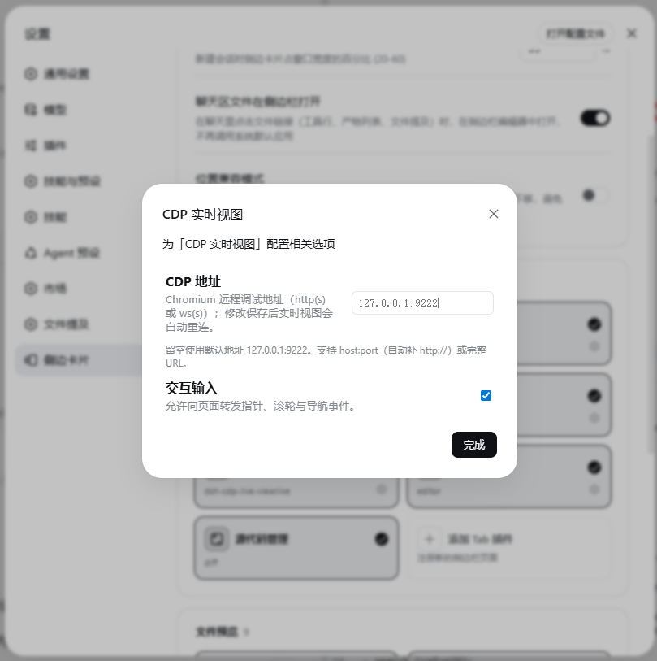
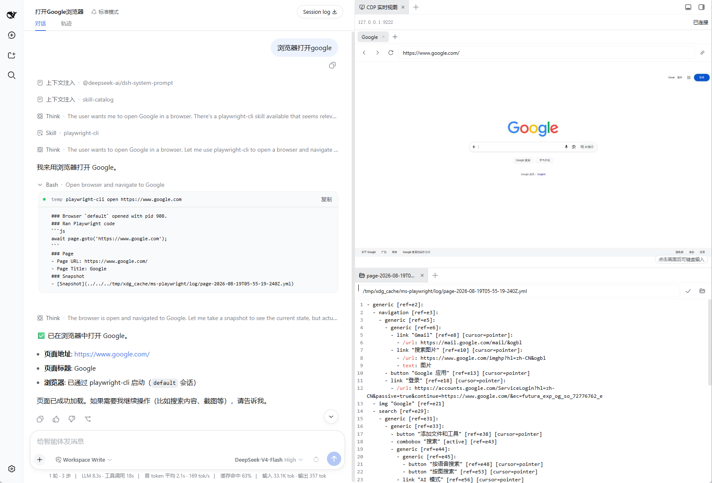

# dsh-sidebar-cdp-browser

DSH 双端插件:在 DSH Web 侧边栏中实时查看并操控一个外部 Chromium 浏览器。

目标网页**不会**作为 iframe 运行在 DSH 页面里——Host 进程独占 CDP 连接,把页面抓成像素帧推给浏览器,Client 只在 Canvas 上渲染,并回传一组**严格受限**的交互命令。没有任意 CDP 透传,没有跨源 iframe 的麻烦。

> **依赖**:本插件基于侧边栏框架 [dsh-better-sidebar](https://github.com/omdsh-dev/DSH-better-sidebar)(`>=0.13.0`)注册 Tab。它是**必选 peer 依赖**——不安装它,本插件的 Tab 不会出现。请用下面的一句组合命令一起安装。

## 用途

- 在 DSH Web UI 内提供一个「CDP 实时视图」侧边栏 Tab:看到 Chromium 里正在发生什么,并在允许的范围内直接操作它;
- Host 是唯一接触 raw CDP WebSocket 的一端:Client 浏览器既拿不到 CDP 地址,也发不出任意 CDP 命令;
- 像素流 + 受控输入的模型,天然适合把一个浏览器会话「投影」给多个观察者,或交给 AI 会话的操纵者监督。

## 使用场景

- **远程 / 无头 Chromium 可视化**:浏览器跑在服务器或容器里,你在 DSH 界面里直接看、直接点;
- **在 DSH 会话中观察浏览器自动化**:让 agent 操作浏览器的同时,人可以实时盯着画面,随时接管;
- **轻量 VNC 替代**:只针对浏览器这一种「远程桌面」,不需要装任何客户端;
- **受控演示 / 排查**:把一个测试浏览器投影给同事看,导航、点击都在你的权限模型之内。

## 安装方法

### 前提

- Node.js >= 20;
- DSH Web profile(`web`);
- `dsh-better-sidebar >= 0.13.0`(见顶部依赖说明);
- 一个已启动、且能从 DSH Host 进程访问的 Chromium CDP endpoint。示例:

```sh
chromium \
  --remote-debugging-address=127.0.0.1 \
  --remote-debugging-port=9222
```

### 从 npm 安装(推荐)

一条命令同时安装两个插件(DSH 按 profile 直接依赖激活插件层,缺了 better-sidebar 本插件不会生效):

```sh
dsh plugin --profile web add dsh-better-sidebar dsh-sidebar-cdp-browser
```

安装后重启 `dsh web` 使新插件层生效。

> pnpm 可能拦截 better-sidebar 的原生依赖构建(如 `node-pty`),按提示把具体包名加入 profile 目录下 `pnpm-workspace.yaml` 的 `allowBuilds` 后重跑即可。

### 从 GitHub 源安装

```sh
dsh plugin --profile web add dsh-better-sidebar github:chendefine/dsh-sidebar-cdp-browser
```

git 依赖在安装时通过 `prepare` 脚本构建,同样需要在 `allowBuilds` 放行 `dsh-sidebar-cdp-browser`(pnpm 会打印确切的 key)。

## 使用方法

### 配置 CDP 地址

CDP 地址**在 DSH Web 设置页配置**,不需要改 profile 数组:



1. 打开 **设置 → 侧边卡片 → 侧边栏内容 → CDP实时视图**,点击卡片右下角的齿轮;
2. 在「CDP 地址」输入框填写地址,失焦或按 Enter 保存;
3. **留空 = 默认地址 `127.0.0.1:9222`**;
4. 支持的格式:
   - `host:port`(自动补 `http://`)或 `http://host:port`:Host 从 `/json/version` 发现 `webSocketDebuggerUrl`;
   - `https://` / `wss://`:同上,TLS 由部署层保证;
   - `ws://.../devtools/browser/...`:直接连接 browser WebSocket;
5. 保存后 Host 断开旧连接,已打开的实时视图自动重连到新地址。

地址持久化在 better-sidebar 的 prefs 文档(`pluginSettings['dsh-sidebar-cdp-browser:live'].endpoint`),Host 通过 DSH settings 服务读取并订阅变更。**没有 loopback 限制**——远程地址直接可用,请自行确保网络可达与访问控制。

同一设置面板里还有「允许交互」开关:

- **关闭(默认)**:observe 模式,只能看;
- **打开**:interactive 模式,可以点击、输入、导航、新建/关闭标签页。

### 日常操作



- **标签页(target)切换 / 新建 / 关闭**:顶部标签条,需要 interactive 模式;
- **鼠标**:点击、拖动、滚轮,坐标按帧画面映射回页面;
- **键盘**:先点击画面获得焦点,之后直接输入。中文等 IME 走 composition 合成后一次性提交;粘贴经本机剪贴板转成文本插入;**复制(Ctrl+C)暂不支持**;
- **导航**:工具栏输入 HTTP(S) 地址回车,或使用 back / forward / reload;
- **连接**:工具栏可手动重连;断线后客户端自动退避重连。

### Loader 运行时调优(可选)

profile 配置里的可选项(均可省略,括号内为默认值与范围):

```yaml
- insert:
    - id: sidebar-cdp-browser
      name: dsh-sidebar-cdp-browser
      config:
        frameQuality: 60        # JPEG 质量 (20–90)
        frameMaxWidth: 1280     # 帧最大宽 (320–3840)
        frameMaxHeight: 900     # 帧最大高 (240–2160)
```

| 字段                      | 默认值  | 范围                             |
| ------------------------- | ------- | -------------------------------- |
| `ticketTtlMs`             | 30000   | 5000–120000,一次性 ticket 有效期 |
| `connectTimeoutMs`        | 15000   | 1000–120000,CDP 连接超时         |
| `frameQuality`            | 60      | 20–90,JPEG 质量                  |
| `frameMaxWidth`           | 1280    | 320–3840                         |
| `frameMaxHeight`          | 900     | 240–2160                         |
| `frameEveryNth`           | 1       | 1–30,每 N 帧取 1 帧              |
| `bufferedAmountSoftLimit` | 524288  | 64KB–16MB,超过开始丢帧           |
| `bufferedAmountHardLimit` | 4194304 | 256KB–64MB,超过断开连接          |

### 故障排查

被拒绝的 WebSocket 升级返回明确的 HTTP 状态,浏览器控制台显示 `Unexpected response code: <status>`:

- **401**:ticket 无效或已过期(先调 `/open` 拿新 ticket);
- **403**:trust fence 拒绝(Host 头不在信任列表,或带 cross-site 标记);
- **404**:路径错误;
- **1006(无状态码)**:请求在反向代理层就被掐断了。反代必须转发 WebSocket 升级头:

```nginx
map $http_upgrade $connection_upgrade {
    default upgrade;
    ''      close;
}
location / {
    proxy_pass http://127.0.0.1:3080;
    proxy_http_version 1.1;
    proxy_set_header Upgrade $http_upgrade;
    proxy_set_header Connection $connection_upgrade;
}
```

CDP 连接失败会在 DSH Host 日志里输出 `[dsh-sidebar-cdp-browser] CDP session attach failed: ...`,浏览器端只看到断连,排障先看 Host 日志。

## 技术原理

### 双端架构

```text
┌──────────────── DSH Host 进程 ────────────────┐      ┌── Chromium ──┐
│  Host half (src/index.ts)                     │      │              │
│  ├─ POST /dsh-cdp-live/api/open  ── 签发 ticket│      │  CDP :9222   │
│  ├─ WS   /sidebar/ws/cdp-live    ── 业务协议   │      │  (screencast │
│  └─ EndpointManager → puppeteer-core ────────────────┤   + Input)   │
└───────────────────────────────────────────────┘      └──────────────┘
         ▲ ticket + 二进制帧(JSON 元信息 + JPEG)          ┌── 浏览器 ────┐
         │                                                │ Client half  │
         └────────────────────────────────────────────────┤ Canvas 渲染  │
              鼠标/键盘/导航等受限命令(zod 白名单)          └──────────────┘
```

- **Host half**(`src/`):注入 `webServer` / `sessions` / `webRuntime` 服务,注册 HTTP 与 WebSocket 路由,通过 puppeteer-core 维持唯一一条 CDP 连接;
- **Client half**(`src/client/`,经 `dsh-better-sidebar` 注册 Tab):React 组件,Canvas 渲染帧,输入事件翻译成受限命令。

### 连接握手

```text
POST /dsh-cdp-live/api/open        → trust fence + DSH session 校验
                                   → 签发一次性 256-bit ticket(TTL 默认 30s)
WS   /sidebar/ws/cdp-live?ticket=… → trust fence + ticket 一次性消费
                                   → 101 后进入版本化协议(v: 1)
```

- Client 从头到尾不知道 CDP 地址,也拿不到任何 CDP 凭据——连接和 target ID 都是 Host 进程内的临时状态;
- ticket 绑定 session 与模式(observe / interactive),用一次即废;
- 升级请求**不要求 Origin**:DSH 常见反代模式会把 Host 重写为 loopback 并丢弃 Origin,因此准入门槛是 trust fence(Host + cross-site 标记)加一次性 ticket。

### 帧流水线

```text
Page.startScreencast (JPEG, 质量上限受配置约束)
  → Host 收到 Page.screencastFrame 后立即 ACK(与下游消费解耦)
  → LatestFrameQueue        单槽最新帧队列:生产者永不阻塞,新帧顶掉旧帧
  → ws.send(frameMeta JSON) 元信息(sequence / mimeType / byteLength …)
  → ws.send(JPEG bytes)     二进制帧紧随其后
  → Client Canvas 绘制
```

两级背压基于 `ws.bufferedAmount`:

- 超过**软限**(默认 512KB):丢帧不发送,画面稍旧但连接健康;
- 超过**硬限**(默认 4MB):直接以 1013 断开,防止慢客户端无限积压内存。

Tab 隐藏或面板折叠时(better-sidebar 的 `visible` gating)自动停止帧流,重新可见再恢复。

### 命令协议

Client 能发的命令是一个 zod `strict()` 判别联合(`src/cdp/protocol.ts`),枚举如下,**没有任何 `{method, params}` 形式的任意 CDP 透传**:

- `targets.list` / `targets.create` / `target.select` / `target.detach` / `target.close`
- `visibility`
- `screencast.start` / `screencast.stop`(选项:format / quality / maxWidth / maxHeight / everyNthFrame)
- `input.mouse` / `input.key` / `input.text`
- `navigate`(仅 `http(s)` URL)/ `history`(back / forward / reload)
- `ping`

### 连接与租约管理

- **EndpointManager**:单条隐式 CDP 连接,generation 标识;设置页变更地址 → Host 监听 `settings/document-updated` → 关旧连接、以 1012 弹开客户端 → 客户端退避重连落到新地址;
- **LeaseManager**:同一 target 的 screencast 帧队列同一时刻只有一个消费者,切换 target 先释放旧租约;
- **TargetRegistry**:target 发现、切换与销毁通知(title 以 `Target.getTargets` 快照为准,1s 轮询)。

### 安全边界

默认开放的 CDP 能力仅包括:target 生命周期、screencast start/stop/ack、`Input.dispatch*`、`Page.navigate` / `Page.reload` / navigation history。

默认**不**开放:

- `Runtime.evaluate`;
- Cookie / Storage / Network;
- 下载、上传、权限授予;
- 任意 CDP method passthrough;
- DevTools frontend。

注意两点:

1. CDP 地址由 Web UI 配置,Host 不施加 loopback 限制——能打开该设置页的会话就能让 DSH Host 向任意地址发起连接,请仅在可信环境暴露设置页;
2. trust fence 防的是 cross-site 与 DNS rebinding,**不替代用户认证**;Keyless DSH 应仅作为本机单用户工具使用。

### 目录结构

```text
src/
├── index.ts              Host half 入口(路由注册、settings 订阅)
├── config.ts             配置 schema 与 endpoint 归一化
├── trust-fence.ts        Host/cross-site 信任判定
├── routes/
│   ├── http.ts           /open 路由 + ticket registry
│   └── websocket.ts      WS 升级路由(trust fence + ticket 准入)
├── cdp/
│   ├── live-session.ts   会话编排:attach、命令分发、帧泵
│   ├── endpoint-manager.ts / browser-connection-manager.ts / puppeteer-adapter.ts
│   ├── screencast-controller.ts / frame-queue.ts
│   ├── input-controller.ts / target-controller.ts / target-registry.ts
│   ├── lease-manager.ts  target 独占租约
│   └── protocol.ts       版本化协议 zod schema
└── client/               better-sidebar Tab(React + Canvas + 输入桥接)
tests/                    vitest(协议、安全、队列、键盘桥接、wiring 等)
```

## 开发

```sh
pnpm install
pnpm typecheck
pnpm test      # 构建后跑 vitest
pnpm build
```

构建产物:

```text
lib/index.js             Host half
lib/client.js            web profile client bundle
lib/types/               类型声明
```

## 已知限制

- 一个 target 同一时刻只支持一个消费中的 screencast 帧队列;
- Chromium 的启动与进程生命周期不由插件管理;
- target title 以 1s 轮询的命令快照为准,导航后有短暂延迟;
- 键盘:复制(Ctrl+C)暂不支持(需要读取远端选区,后续版本提供);Touch、文件上传/下载、完整 DevTools 未实现;
- 未实现 `Page.captureScreenshot` 兼容回退;
- 远程、多用户、多 Host 部署需要外部认证、共享 ticket store 和更严格的网络策略。

## 许可证

[MIT](./LICENSE)
